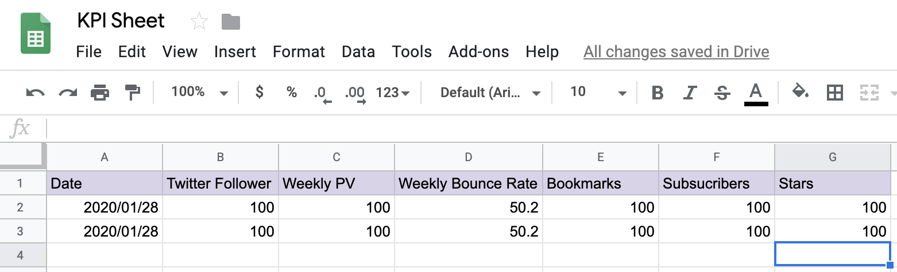

# blog-kpi-collector
Collect KPIs for blog

Googleスプレットシートで定期的にブログの情報を集計するためのApps Scriptを生成するスターターキットです。



このリポジトリを使ってApps Scriptとスプレットシートを作成すると、以下のKPI情報をシートに書き込んでいきます。  
未設定にしておけば取得もしないので、全てサービスからの情報が不要な方でも利用できます。 
後述するトリガーを設定しておくことで定期的にデータを集計できます。 

```
Twitter | フォロワー数
Google Analytics | 前日までの週間PV数、 前日までの週間直帰率
はてなブックマーク | はてなブックマーク総数
```

# 使い方
# 初期設定
自分のPCで`clasp`コマンドを利用する準備をします。以下のページを参考に`clasp login`まで済ませておきます。

- GAS のGoogle謹製CLIツール clasp
    - https://qiita.com/HeRo/items/4e65dcc82783b2766c03

このリポジトリをローカルに持ってきて、パッケージ群をインストールします。

```bash
git clone git@github.com:budougumi0617/blog-kpi-collector.git
cd blog-kpi-collector

npm install
```


`clasp create`コマンドでAdd-on script（Apps Scriptプロジェクト）と紐付けるスプレットシートを作成します。
```bash
$ clasp create --title "KPI Sheet" --type sheets --rootDir ./src
Created new Google Sheet: https://drive.google.com/open?id=....
Created new Google Sheets Add-on script: https://script.google.com/d/..../edit
Cloned 1 file.
└─ ./src/appsscript.json
```

出力されたAdd-on scriptとSpread SheetのURLをメモしておきます。その後、一度`clasp pull`して連携したあと、`clasp push`コマンドでコードをDriveに送ります。

```bash
$ clasp pull
Cloned 2 files.
└─ ./src/appsscript.json
└─ ./src/Code.js

$ clasp push
└─ src/Code.js
└─ src/appsscript.json
└─ src/googleAnalytics.ts
└─ src/hatena.ts
└─ src/main.ts
└─ src/twitter.ts
Pushed 6 files.
```


Add-on scriptのURLを開きます(`clasp open`コマンドでも開きます)。
`main.gs`ファイルを選択し、`main`関数を実行します。


「承認が必要です」と出てくるので「許可を確認」→アカウントを選択→「詳細」→「KPI Sheet（安全ではないページ）に移動」→「許可」とクリックしていきます。

実行後、スプレットシートを開き、以下の状態になっていたら初期設定は終了です。


スクリプトのプロパティにアカウントIDなどを入力すれば実行のたびに最後の行に新しい情報が追加されていきます。
（必要に応じて最初の行に列情報を書いておくといいでしょう）


## 「スクリプトのプロパティ」を設定する
Web上でAdd-on script（Apps Scriptプロジェクト）を開いたあと、スクリプトのプロパティに以下の変数を設定します。
なお、未入力の場合は対応するサービスから値が取得されません。

|    変数名   | 値 | 説明 | 例 | 
|---|---|---|---|
| `SHEET_NAME` | 集計したいシートの名前 | 未設定の場合は「シート1」に集計する| master |
| `TWITTER_NAME` | Twitter ID | フォロワー数を取得する | budougumi0617
| `GA_VIEW_ID` | | GA ID | 一週間のPV数と直帰率を集計する | ga:000000000 |
| `BLOG_URL` | ブログのURL | はてなブックマーク数を取得する | https://budougumi0617.github.io/ |
| `HATENA_BLOG` | true or another | `BLOG_URL`が設定済みであることがであることが前提。はてなブログ読者数を取得する、未設定もしくはtrue以外の設定は未入力と同じく値を取得しない | true |


## スクリプトのプロパティの設定方法
1. このリポジトリで作成したApps Scriptのプロジェクトを開く
  - https://script.google.com/u/1/home
2. メニューの中の「ファイル」→「プロジェクトのプロパティ」をクリックする

3. 「プロジェクトのプロパティ」ウインドウの「スクリプトのプロパティ」タブをクリックする
4. 設定するプロパティの名前と値を入力していく


# Google Analyticsとの連携方法
Google Analyticsとの連携には`GA_VIEW_ID`の他にAnalytics APIを有効にする必要があります。

## GA_VIEW_IDの調べ方
まず、Google Analyticsの情報を取得するためのIDの取得方法は以下の通りです。

1. 以下のURLを開く
   - https://ga-dev-tools.appspot.com/query-explorer/#report-start
2. `Select View`で集計したいデータを選択する
3. `Set the query parameters`の`ids`に自動入力される`ga:000000000`というIDをGA_VIEW_IDとする


## Analytics APIを有効にする
1. Add-on scriptのメニューから「リソース」→「Google の拡張サービス」を選択し、Google Analytics APIを有効にします。


2. Google Cloud Platform API ダッシュボード へのリンクがあるのでクリックすると、別のウインドウが開きます。
3. APIを有効にするボタンをクリックして「Analitycs API」を探し、有効にします。


4. もう一度Add-on scriptに戻り`main`関数を実行すると、最初に出てきた認可ウインドウが表示されるので、最初と同じように「許可」をします。


# 定期的に実行する（トリガーを設定する）
Add-on scriptの時計のアイコンからトリガーを設定することができます。
メニューの中の「編集」→「現在のプロジェクトのトリガー」から定期的に`main`関数を実行するようにします。

## トリガーが時間どおりに動かない場合
タイムゾーンがずれているかもしれません。
メニューの中の「ファイル」→「プロジェクトのプロパティ」をクリックし、「プロジェクトのプロパティ」ウインドウ内の「情報」タブの中に「タイムゾーン」の設定があるのでそちらを確認してください。

# 要望など
Issueでお願いします。

https://github.com/budougumi0617/blog-kpi-collector/issues/new

# 製作者
@budougumi0617

# ライセンス
MIT
